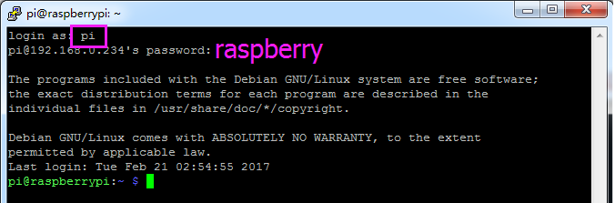

.. _login_windows:

PuTTY
=========================

If you are a Windows user, you can use some applications of SSH. Here, we recommend `PuTTY <https://www.chiark.greenend.org.uk/~sgtatham/putty/latest.html>`_.

**Step 1**

Download PuTTY.

**Step 2**

Open PuTTY and click **Session** on the left tree-alike structure. Enter
the IP address of the RPi in the text box under **Host Name (or IP
address)** and **22** under **Port** (by default it is 22).

.. image:: img/image25.png
    :align: center

**Step 3**

Click **Open**. Note that when you first log in to the Raspberry Pi with
the IP address, there prompts a security reminder. Just click **Yes**.

**Step 4**

When the PuTTY window prompts \"**login as:**\", type in
\"**pi**\" (the user name of the RPi), and **password**: \"raspberry\"
(the default one, if you haven't changed it).

.. note::

    When you input the password, the characters do not display on window accordingly, which is normal. What you need is to input the correct password.
    
    If inactive appears next to PuTTY, it means that the connection has been broken and needs to be reconnected.
    

**Step 5**

Here, we get the Raspberry Pi connected and it is time to conduct the next steps.