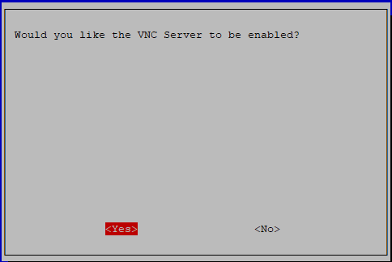
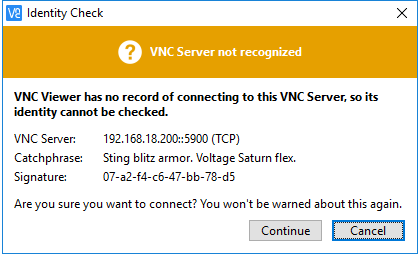
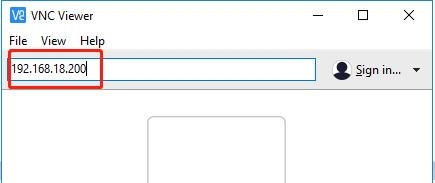
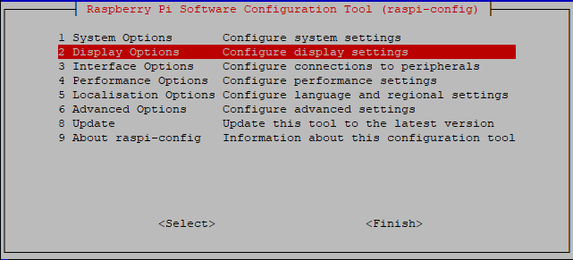
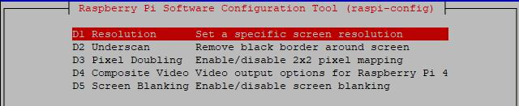
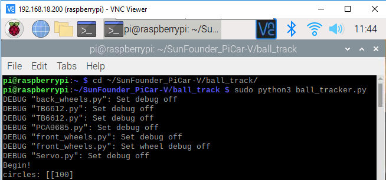
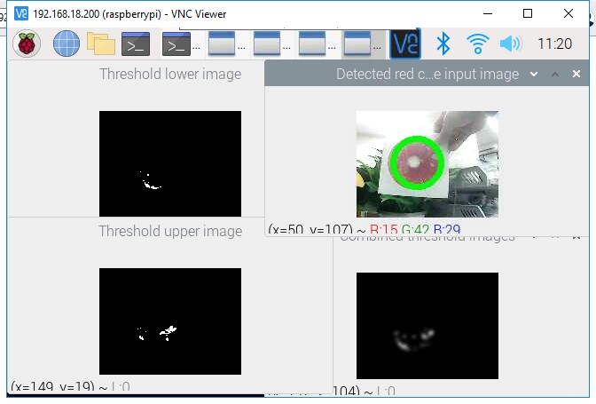

ball_tracker
============

In addition to using the keyboard to control the status of the car, we
also wrote a ball tracking code.

.. raw:: html

    <run></run>

.. code-block:: 

    sudo apt-get install libatlas-base-dev libjasper-dev libqt4-test libwebp6 libtiff5 libopenexr23 libgstreamer1.0-0 libavcodec-dev libavformat-dev libswscale-dev libqtgui4 -y
    sudo pip3 install opencv-python==3.4.6.27
    cd ~/SunFounder_PiCar-V/ball_track
    python3 ball_tracker.py

After the code runs, find a red ball (at least larger than the diameter
of the camera) and put it within 10-50cm range in front of the camera to
get the car to follow your ball.

.. image:: media/image103.jpeg
   :width: 6.66667in
   :height: 3.00347in
   :align: center

If you want to know whether the car has catched your ball, you can do as
follows:

**Step 1:** Enable the VNC on the Raspberry Pi.

.. raw:: html

    <run></run>

.. code-block:: 

    sudo raspi-config

Choose **3** **Interfacing Options** by press the down arrow key on your
keyboard, then press the **Enter** key..

.. image:: media/image104.png
   :width: 6.69792in
   :height: 2.79167in
   :align: center

**P3 VNC**

.. image:: media/image105.png
   :width: 6.6875in
   :height: 2.72917in
   :align: center

Press the left arrow key on your keyboard to choose **Yes.**

Finally select **OK**->\ **Finish** to exit the config.

.. image:: media/image107.png
   :width: 5.04167in
   :height: 3.36458in
   :align: center

**Step 2:** Download the VNC Viewer for your computer and install it.

https://www.realvnc.com/en/connect/download/viewer/

.. note::
    During your installation on your Windows, if you encounter the
    following prompt, please click **Continue** to continue your
    installation.

**Step 3:** Open VNC Viewer you have installed, type in your Raspberry
Pi IP address, and press the Enter button.

**Step 4:** Enter the username and password of your Raspberry Pi on this
page, by default, they are pi and raspberry; then click OK.

.. image:: media/image110.png
   :width: 3.64583in
   :height: 3.03125in
   :align: center

When you log in with VNC Viewer, the screen may be black.If your screen
is working, skip to Step 5.

.. image:: media/image111.png
   :width: 4.36111in
   :height: 2.98264in
   :align: center

Changing the resolution to the highest on the Raspberry Pi.

.. raw:: html

    <run></run>

.. code-block:: 

    sudo raspi-config

Choose **2 Display Options**.

Choose **D1 Resolution**.

Change the default to a higher resolution like **Mode 16**, then click
**OK**.

.. image:: media/image114.png
   :width: 5.03125in
   :height: 2.0625in
   :align: center

Reboot the Raspberry Pi, log in again, and it will work.

.. raw:: html

    <run></run>

.. code-block:: 

    sudo reboot

**Step 5:** Now, we enter the Raspberry Pi desktop, click Terminal and
type the following commands to open the code ball_tracker.py.

.. raw:: html

    <run></run>

.. code-block:: 

    cd ~/SunFounder_PiCar-V/ball_track
    sudo nano ball_tracker.py

Then modify the code as follows:

.. raw:: html

    <run></run>

.. code-block:: 

    Show_image_enable = True
    Draw_circle_enble = True

Press Ctrl+X and Y to save the change.

.. image:: media/image115.png
   :width: 6.8125in
   :height: 4.53125in
   :align: center

.. note::

    After you finish doing this step, you must log in the Raspberry Pi
    via VNC, or you can use a monitor; if not, the warning is as follows:

.. image:: media/image116.png
   :width: 6.80764in
   :height: 0.45208in
   :align: center

**Step 6:** Run the ball_tracker.py.

.. raw:: html

    <run></run>

.. code-block:: 

    python3 ball_tracker.py

**Step 7:** After running the code ball_tracker.py, these four images
will appear. If you place a red ball in front of the camera, you can see
a green circle which represents that the car has catched your red ball.

