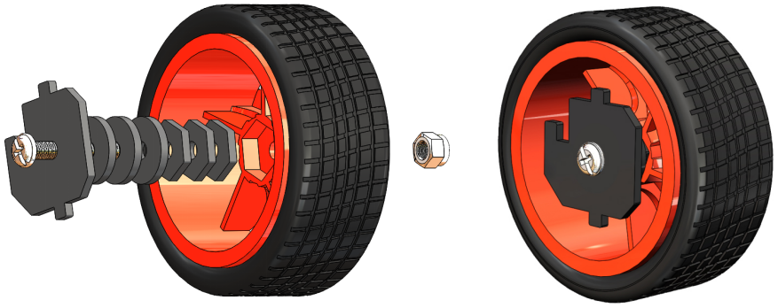
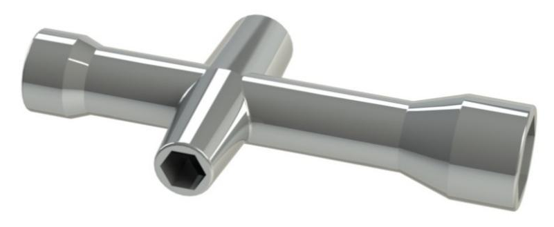
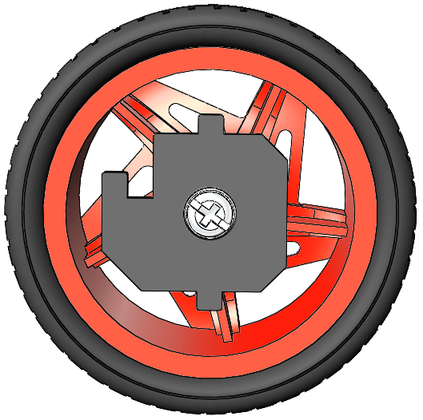
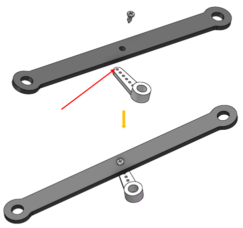
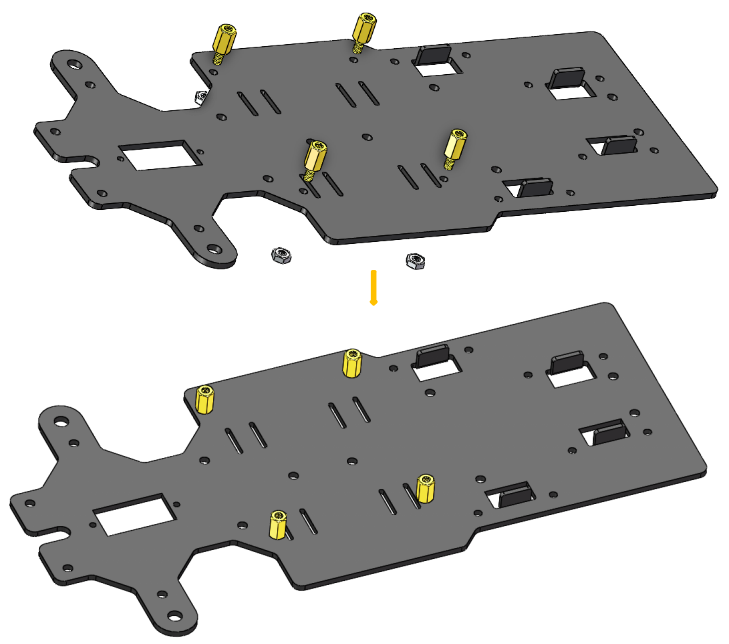
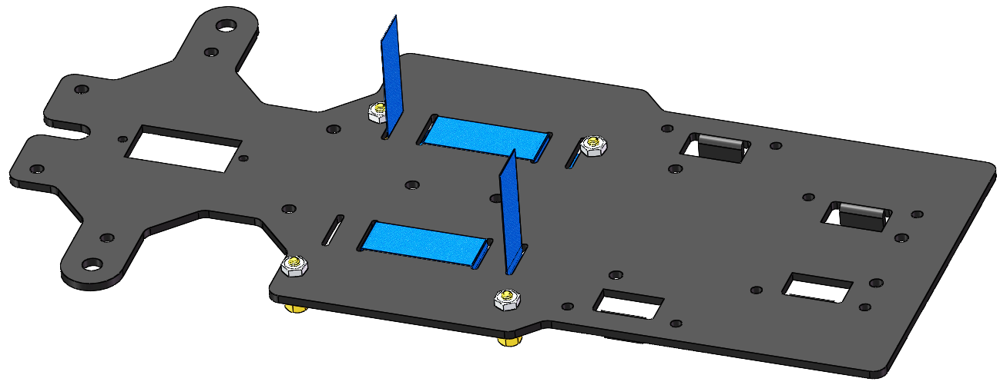
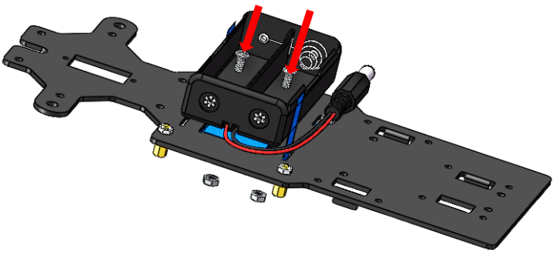
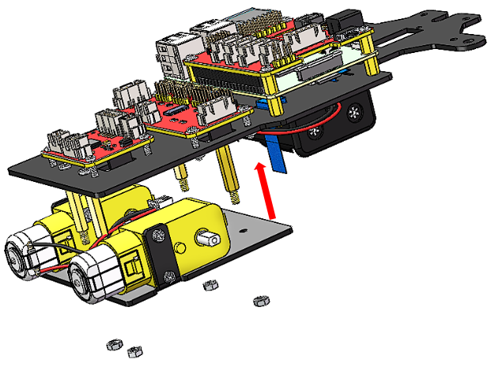
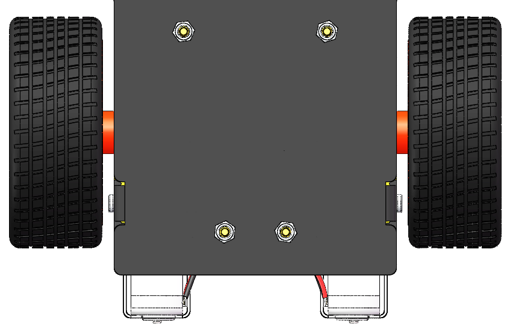

Building the Car
==================

Are you excited when you open the box and see so many components? Keep
your patience and take it easy. Please note that some details in the
following steps need careful observation. You should double-check your
work based on the figures in the manual after finishing each step. let’s
start!

Front Wheels
--------------

Insert an **M4x25 screw** through a **Steering Connector Plate**, 3
**Bearing Shields**, 3 **Hex Front Wheel Fixing Plates**, and a **front
wheel**, into an **M4 Self-locking Nut** as shown below:

You can use the Cross Socket Wrench to secure the **M4 Self-locking
Nut**, then use the screwdriver to tighten the **M4x25 screw.**

.. note::
    The Self-locking Nut should be screwed tight enough. It would be better
    to tighten the screw until the wheel and Steering Connector cannot move
    first, then loosen the screw a little, so that the Steering Plate can
    just move. Thus, the wheel can turn flexibly when the connection would
    not be too loose.

Assemble the other front wheel in the same way, but bear in mind the
Steering Connector plate on the wheel should be symmetric with the
previous one.

Now two front wheels have finished assembly.

Pan-and-Tilt
------------

Take out the **Cross rocker arm** and mount it onto the **Pan-and-tilt
Base Plate** with 2 **M1.5x4 screws** (into the hole like this). Pay
attention to the holes on the round rocker arm to be fastened.

.. image:: media/Pan-and-Tilt1.png
    :align: center

Do the same operation to the **Camera Mount Plate**.

.. image:: media/Pan-and-Tilt2.png
    :align: center

Assemble the two servos to the **Pan-and-tilt Plate** with four **M2x8
screws** and the **M2 nuts** (The 2 servo shaft are close to the left
side ):

.. image:: media/Pan-and-Tilt3.png
    :width: 600
    :align: center

Steering Part
-------------

Connect the **Steering Linkage** and the **1-arm Rocker Arm** with the
**M1.5x4 Self-tapping Screw**.

.. note::
    Insert it into the **FIRST** hole of the arm (as indicated by the
    **arrow** below) which is the farthest from the gears.

And also fasten them as tightly as possible, and then loosen the screw a
little so the Steering Linkage can move flexibly.

Upper Plate
-----------

Mount the **M2.5x8 copper standoffs** and **M2.5 nuts** into the **upper
plate** first. Pay attention that the side the protruding prop should
face up.

Battery Holder
--------------

Turn the Upper Plate upside down. Cut the **ribbon** into two halves.
Thread them through the holes on the plate. Pay attention to the
direction and leave one end longer out of the plate for each to remove
the battery easily later.

Fasten the battery holder with two **M3x8 countersunk screws** and **M3
nuts**. Pay attention to the direction of battery holder’s wire.

Rear Wheels (Screws)
--------------------

Insert 4 **M3x8 screws** with four **M3x25 copper standoffs**:

.. image:: media/Rear_Wheels.png
    :align: center

PCB Assembly
------------

1) Assemble the **Raspberry Pi** (TF Card inserted) with 8 **M2.5x8
   single pass** **copper standoffs**, then plug the **Robot HATS** onto
   it.

2) Fix the **Robot HATS** with 4 **M2.5x6** **screws**.

3) Fix The **PCA9685 PWM Driver** and the **Motor Driver** with 8
**M2.5x12** **screws and M2.5 nuts** into the **down plate：**

.. image:: media/PCB_Assembly.png
    :align: center

Fixing Rear Wheels
------------------

Assemble the two motors with four **M3x25 screws** and **M3 nuts**. Pay
attention to place the motors with wires inward, providing convenience
for connecting the circuit.

.. image:: media/Fixing_Rear_Wheels1.png
    :align: center

Assemble the rear wheels with 4 M3 nuts.

Align the **rear** **wheels** with the motor shaft, and rotate to insert
them gently.

