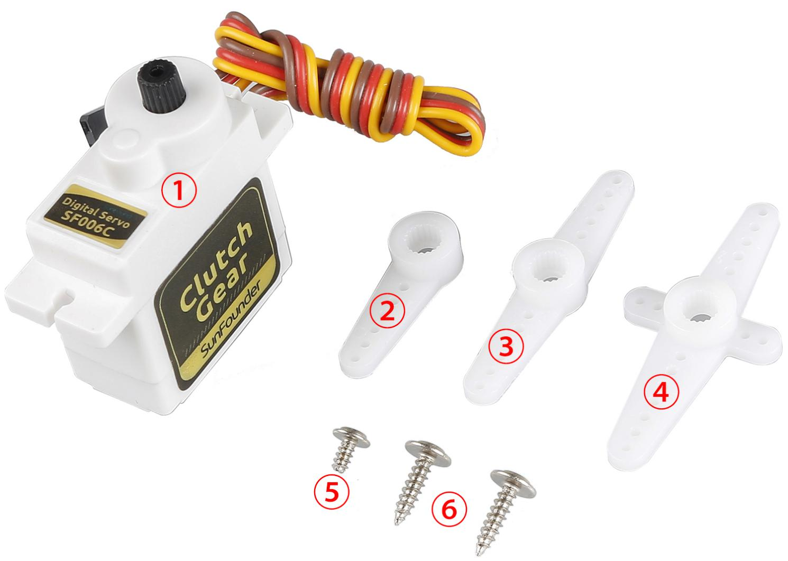
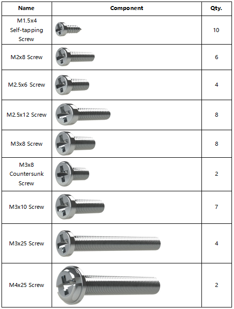
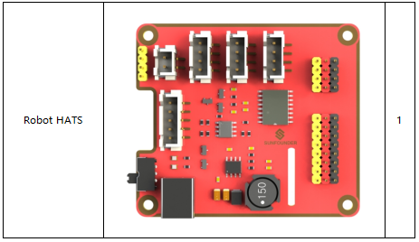
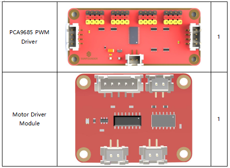
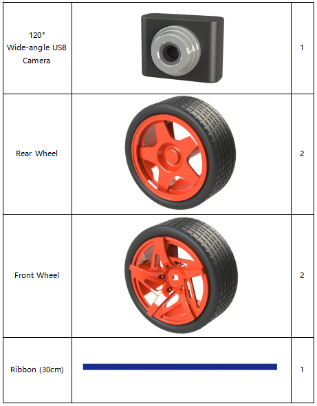
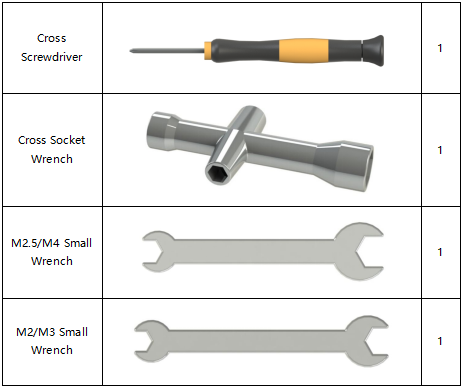
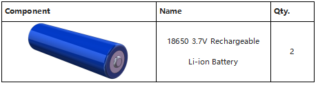

Components List
===============

Plates
------

.. image:: media/image3.jpeg
   :alt: 图片12
   :width: 6.80833in
   :height: 5.73819in

1.  Upper Plate x 1

2.  Front Half Plate x 1

3.  Back Half Plate x 1

4.  Pan-and-tilt Plate x 1

5.  Pan-and-tilt Base Plate x 1

6.  Camera Mount Plate x 1

7.  Steering Connector Plate x 2

8.  Bearing Shield x 8

9.  Steering Linkage Plate x 1

10.  Hex Front Wheel Fixing Plate x 8

11. Gasket Plate x 2

.. note::

    The Bearing Shield is similar to the Gasket Plate, but the aperture of Gasket Plate is large than the Bearing Shield.

Servo x 3
---------

1. Servo

2. 1-arm Rocker Arm

3. arm Rocker Arm

4. 4-arm Rocker Arm

5. Rocker Arm Fixing Screw

6. Rocker Arm Screw

Mechanical Fasteners
--------------------

.. image:: media/Mechanical_Fasteners2.png

Wires
-----

.. image:: media/Wires.png

PCB
---

Other Components
----------------

.. image:: media/Other_Components1.png

Tools
-----

Self-provided Components
------------------------

The following components are not included in this kit.

.. note::
    1. You are recommend to use 18650 batteries **without** a protective
    board. Otherwise, the car may be cut power and stop running because
    of the overcurrent protection of the protective board.

    2. For unprotected batteries, please purchase those with the anode
    bulged out (as shown below), so that it can ensure the well
    connection with the battery holder.

    .. |image37| image:: media/image37.jpeg
        :width: 200
        :height: 200
    .. |image38| image:: media/image38.jpeg
        :width: 150
        :height: 200
    |image37|\ |image38|
    
    3. In order to keep the car working for a long time, use large-capacity
    batteries as much as possible