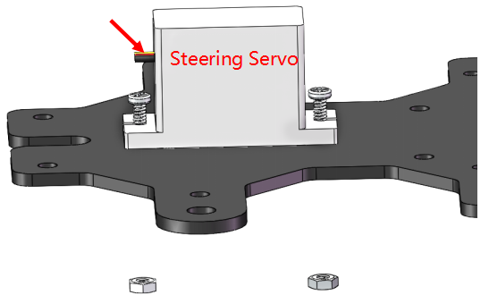
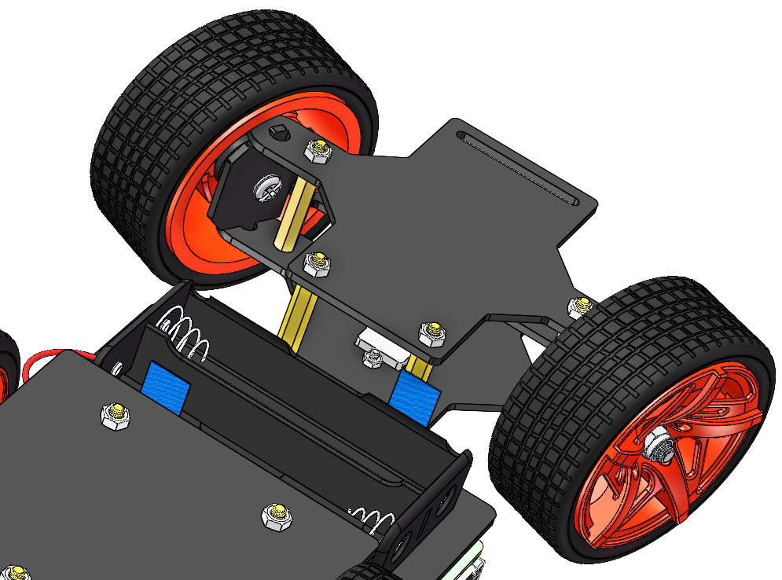
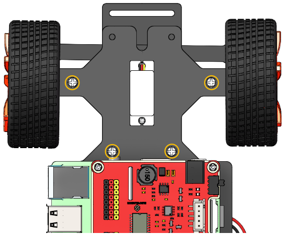
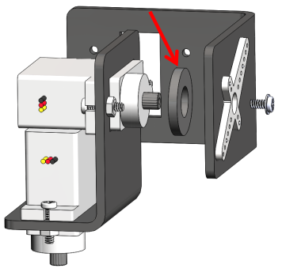
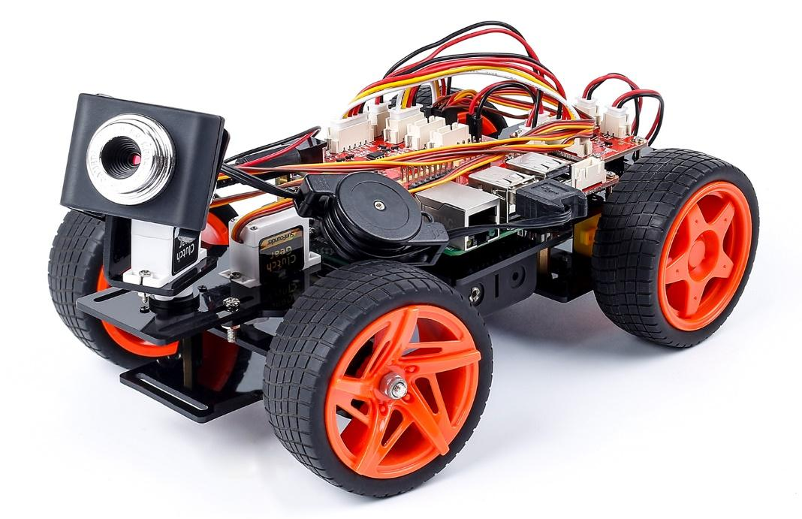

Continue to Assemble
===============================

.. warning::
    Please do forget to put in the battery and slide the power switch to ON,
    then keep servo-install running in the whole process of assembly.

Assemble the Steering Servo
----------------------------

Mount the **Steering Servo** to the Upper Plate with two **M2x8 Screws**
and **M2 nuts** (pay attention to the direction of the servo wires):

Front Half Chassis
-------------------

The **Rocker Arm** is facing straight ahead, and then inserted into the
Servo shaft, and then fixed with **Rocker Arm Fixing Screw** (the
shortest).

.. image:: media/Front_Half_Chassis1.png
    :align: center

Mount the wheels onto the Upper Plate carefully.

.. image:: media/Front_Half_Chassis2.png
    :align: center

Assemble the **Front Half Chassis** with four **M3x25 copper standoffs**
and **M3 nuts**.

.. image:: media/Front_Half_Chassis3.png
    :align: center

Then put the assembled Front Half Chassis onto the Upper Plate with
standoffs aligned with the holes.

Hold them carefully, turn upside down, and fasten the standoffs and
Upper Plate with four **M3x8 screws.**

Assemble the assembled **Pan-and-tilt Plate, Gasket Plate** and **Camera
Mount Plate** with the **Rocker Arm Fixing Screw** in a fixed angle as
shown below:

.. note::
    Do not rotate the servo by hands in case of breaking the servodown.

Similarly check that the servo shaft has spun to 90 degrees. Then
assemble the **Pan-and-tilt Base Plate** with the **Rocker Arm Fixing
Screw** and the **Gasket Plate** in the angle as shown below.

.. image:: media/Front_Half_Chassis7.png
    :align: center

Assemble the **Pan-and-tilt Plate** to the car with two **M3x10 screws**
and the **M3 nuts.**

.. image:: media/Front_Half_Chassis8.png
    :align: center

Assemble the Camera
--------------------

Take out the camera and nip it to the Camera Mount. Connect its USB
cable to the USB port on the Raspberry Pi.

**So now, the whole assembly is DONE! Congratulations! You can power off
the car now! Don’t forget to charge your batteries.**

