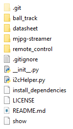

File Analysis
=============

There are two folders under /home/pi: **SunFounder_PiCar** for
controlling motors and steering and **SunFounder_PiCar-V** for pan/tilt
and wireless control. Here look into the code of PiCar-V.

Since too many contents and instructions are involved in the code, we
will not cover every detail. For more knowledge about Python 2, Python
3, Django, HTML, and CSS in the programs, you can visit related websites
or buy books to learn by yourself. In the following part, we will go
through the overall structure and the process in brief.

First, let’s check the files in the code folder:

-  ``.git`` is a hidden directory to store all the information of a Git
   repository; it's generated automatically after you create the
   repository.

- ``Ball_track`` is used to let the car follow the red ball.

-  ``datasheet`` stores the manual of some chips used in the hardware
   modules.

-  ``mjpg-streamer`` is an open source streaming media library, through
   which the data of the camera is transferred.

-  ``Remote_control`` is to store the code of the web server; it controls
   the motor and servo of the car based on the API request.

-  ``.gitignore`` records the requests of file types to be ignored when the
   Github repository is synchronized.

-  ``_init_.py`` is automatically generated when you create a project which
   is a standard necessary document of python package, just leave it
   there.

-  ``i2cHelper.py`` is a Python script written by Python 2 to configure and
   detect the I2C connection.

-  ``install_dependencies``, an executable bash script for simple
   installation and environment configuration.

- ``LICENSE``, as the name suggests, is a text file of GNU V2 license.

-  ``README.md`` and ``show`` record some information normally for statement and
   prompts.

Server Code
-----------

The server code is based on Django 1.10 (adapt to the latest release if
needed). If you are interested in this, you can visit the Django website
https://www.djangoproject.com/. Here we will just learn how the web
server works.

.. note::
    The code may be updated irregularly on Github to fix bugs and release
    some functions update. So the code here is the initial version. You can
    view the updates in the Github repository at:

    https://github.com/sunfounder/SunFounder_PiCar-V/tree/V3.0

Open the code directory and check the file by ``ls``:

.. code-block::

   pi@raspberry:~ $ cd SunFounder_PiCar-V/
   pi@raspberry:~/SunFounder_PiCar-V $ ls
   datasheet   install_dependencies   mjpg-streamer   remote_control
   client          i2cHelper.py       LICENSE         README.md show

``remote_control`` is the main code directory of the web server. Open the
code directory by cd ``remote_control``, and check the file by ls:

.. code-block::

   pi@raspberry:~/SunFounder_PiCar-V $ cd remote_control
   pi@raspberry:~/SunFounder_PiCar-V/remote_control $ ls
   db.sqlite3   manage.py   remote_control   start static

-  ``db.sqlite3`` is generated when you create a Django project.

-  ``manage.py`` is the main program of the Django project and is generated
   when the project is created. It normally does not need to be
   modified.

-  ``remote_control`` includes the main code files.

-  ``start`` is a small script written to run ``sudo python manage.py
   runserver 0.0.0.0:8000``, and servo installation with attribute ``install``
   just for convenience.

-  ``static`` is to store some static pictures on the web.

The Django web server normally runs ``sudo python manage.py runserver`` to
start. The address 0.0.0.0:8000 means the listening address covers all
the addresses on the LAN, and the port number is 8000. Here we will just
focus on the code in ``remote_control`` folder. Go to the directory via ``cd
remote_control``:

.. code-block::

   pi@raspberry:~/SunFounder_PiCar-V/remote_control $ cd remote_control
   pi@raspberry:~/SunFounder_PiCar-V/remote_control/remote_control $ ls
   driver   \__init__.py   settings.py   templates urls.py   views.py   wsgi.py

-  ``driver`` stores the drivers of the car.

-  ``__init__.py`` is automatically generated when you create a Django
   project which is a standard necessary document of python package,
   just leave it there.

-  ``settings.py`` is automatically generated and stores the related
   settings.

-  ``templates`` is a Django app for storing the webs in the html format.

-  ``urls.py`` is generated automatically to configure the URL to associate
   with the code.

-  ``views.py`` is the code for page control which is associated by the URL.
   It calls the templates to show the page and the driver to control the
   car.

-  ``wsgi.py`` is generated automatically and does not need changes. For
   more, please visit the official website of Django.

So here is how the code works: Run the main program ``manage.py`` which will
be associated with ``urls.py`` automatically, to respond to the URL. When
you run the web browser like the Chrome to visit
``http://<rpi_ip_address>:<port>`` or visit the configured API via the
client, the ``manage.py`` will turn to ``views.py`` due to the association of
the ``urls.py.`` Then the ``views.py`` processes this and returns the
templates to the browser. In addition, it will call the ``driver`` package
on the basis of the parameters set in the browser to control the car.

Now open the folder ``driver`` and check:

.. code-block::

   pi@raspberry:~/SunFounder_PiCar-V/remote_control/remote_control $ cd driver/
   pi@raspberry:~/SunFounder_PiCar-V/remote_control/remote_control/driver $ ls
   camera.py   config   \__init__.py   stream.py

The ``driver`` folder mainly includes the driver modules for controlling the
pan and tilt and camera streamer.

``camera.py`` for controlling the pan-and-tilt.

``config`` stores the calibration data.

``__init__.py`` is the essential file of the package and you can just leave it alone.

``stream.py`` is a video streaming service based on the MJPG-streamer.

Exit and open the folder ``templates`` to view:

.. code-block::

   pi@raspberry:~/SunFounder_PiCar-V/remote_control/remote_control/driver $ cd ../
   pi@raspberry:~/SunFounder_PiCar-V/remote_control/remote_control $ cd templates/
   admin.py   \__init__.py   models.py   tests.py
   apps.py    migrations     templates   views.py

This folder is created by the ``manage.py startapp`` just for calling the
templates conveniently. Therefore, the files have not been changed
except for the ``templates``. Open the ``templates`` again:

.. code-block::

   pi@raspberry:~/SunFounder_PiCar-V/remote_control/remote_control/templates $ cd templates
   pi@raspberry:~/SunFounder_PiCar-V/remote_control/remote_control/templates/templates $ ls
   base.html   cali.html   run.html

There are three HTML files that also consist of layers. The low level
``base.html`` stores contents contained on each page such as the ``<head>`` of
HTML, the overall layout, and contents of the home page by default. The
surface layer: ``cali.html`` for calibration and ``run.html`` to control the
car.