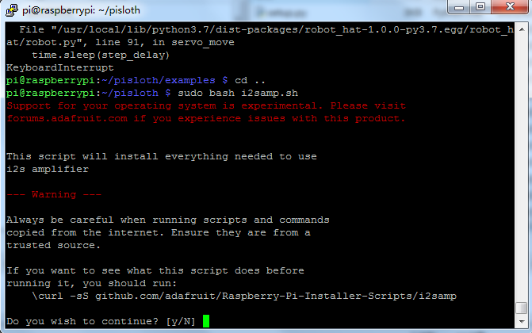
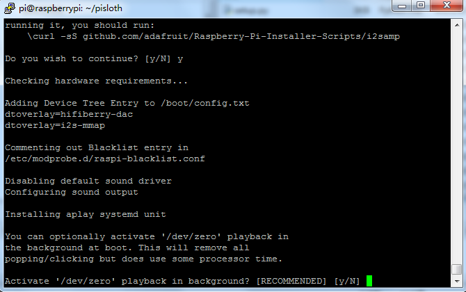
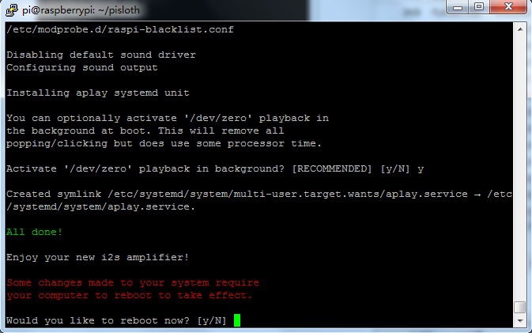

.. _install_all_modules:

Install All the Modules(Important)
========================================

Make sure you are connected to the Internet and update your system:

.. raw:: html

    <run></run>

.. code-block::

    sudo apt update
    sudo apt upgrade

.. note::

    Python3 related packages must be installed if you are installing the Lite version OS.

    .. raw:: html

        <run></run>

    .. code-block::
    
        sudo apt install git python3-pip python3-setuptools python3-smbus

Install ``robot-hat``.

.. raw:: html

    <run></run>

.. code-block::

    cd ~/
    git clone -b v2.0 https://github.com/sunfounder/robot-hat.git
    cd robot-hat
    sudo python3 setup.py install

Then download and install the ``vilib`` module.

.. raw:: html

    <run></run>

.. code-block::

    cd ~/
    git clone -b picamera2 https://github.com/sunfounder/vilib.git
    cd vilib
    sudo python3 install.py

Download and install the ``picar-x`` module.

.. raw:: html

    <run></run>

.. code-block::

    cd ~/
    git clone -b v2.0 https://github.com/sunfounder/picar-x.git
    cd picar-x
    sudo python3 setup.py install

This step will take a little while, so please be patient.

Finally, you need to run the script ``i2samp.sh`` to install the components required by the i2s amplifier, otherwise the picar-x will have no sound.

.. raw:: html

    <run></run>

.. code-block::

    cd ~/picar-x
    sudo bash i2samp.sh
	

Type ``y`` and press enter to continue running the script.

Type ``y`` and press enter to run ``/dev/zero`` in the background.

Type ``y`` and press enter to restart the Picar-X.

.. note::
    If there is no sound after restarting, you may need to run the i2samp.sh script several times.