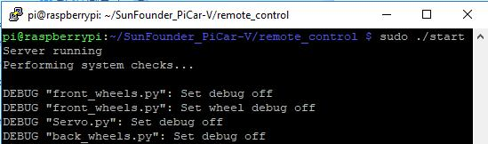
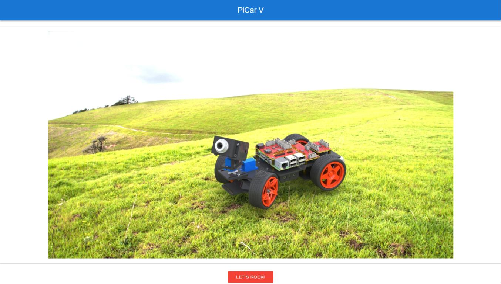
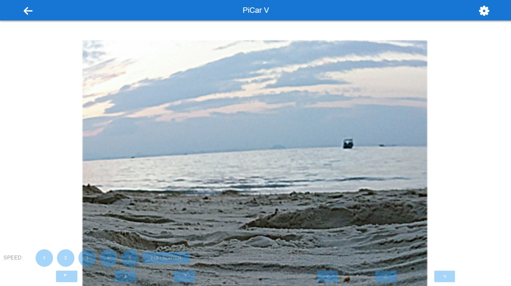
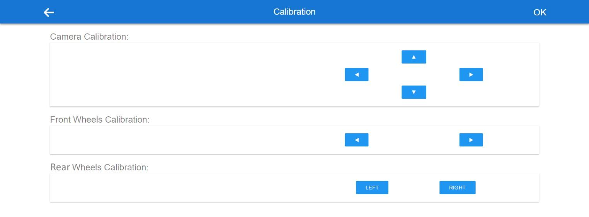

Remote Control
======================

Here is what we're going to do:

Use the Raspberry Pi as the **server**. Run a web server with an API for
controlling the car and transmitting images captured by the camera.

Then take a PC, cell phone, or tablet as the **client**, and acquire the
images from the camera and control the car by calling the API of the web
server.

**Now, you can power on the car again. You are also recommended to use
the power adapter of Raspberry Pi to power your car for that the first
test will take a long time.**

Run the Server(Operation on Raspberry Pi)
-----------------------------------------

Remotely log into the Raspberry Pi. Run the startup script **start**
under the **remote_control** directory to start the web service.

.. raw:: html

   <run></run>

.. code-block:: 

   cd ~/SunFounder_PiCar-V/remote_control
   python3 manage.py migrate
   sudo ./start

The script will enable the service and the corresponding data will
appear. The hardware is initialized at the same time, so the servos
connected to the front wheels and the pan-and-tilt will turn, indicating
the hardware initialization is done.

If you get the result similar as shown above, the server is ready. Now
move on to start the client.

.. warning::
   Keep the server being running all the time until you stop to run the Client.

Run the Client(Operation on PC)
-------------------------------

Visit the server of the car at ``http://<RPi_IP_address>:8000/``. You will see a welcome page:

Click LET'S ROCK to go to the operation interface:

On this page, you can press the keys **W**, **A**, **S**, and **D** on
the keyboard to control the car to move **forward**, **backward**,
**turn left**, and **turn right**, press the arrow keys to control the
camera’s movement, and number **1~5** to change the speed level.

**Calibration**

Click **FULLSCREEN** again to bring back the title bar. And then, tap
the setting button at the top-right corner of the page to go to the
calibration page:

There are three calibration parts: **Camera Calibration**, **Front
Wheels Calibration** and **Rear Wheels Calibration**.

When you enter this page, the car will go forward; if not, click
**Left** and **Right** in **Rear Wheels Calibration** to adjust the
angle of the wheel.

.. note::
   Every time you press a button, the angle will be changed slightly. For
   your larger change per time, you need to long press the button.

   Click **OK** to save the result after all the calibration is done.

**For Mobile Phones**

Also for mobile phones, tap the **FULLSCREEN** button to have a better
view and performance. Then, tap the buttons of 5 speed levels on the
page to control the speed, and the arrow buttons to control the
direction of the car and the pan-and-tilt. But you can only tab one
touch point at **one** time.

.. image:: media/image101.jpeg
   :width: 6.91944in
   :height: 4.15069in
   :align: center

Take this screenshot from an Android phone:

.. image:: media/image102.jpeg
   :width: 6.91667in
   :height: 3.89583in
   :align: center

Though the appearance may not be as good as on the PC. Later updates may
be released irregularly on **Github**. You are welcome to fork our
repository and submit a Pull request with your changes. If there is no
problem after testing, we are more than pleased to merge your request.