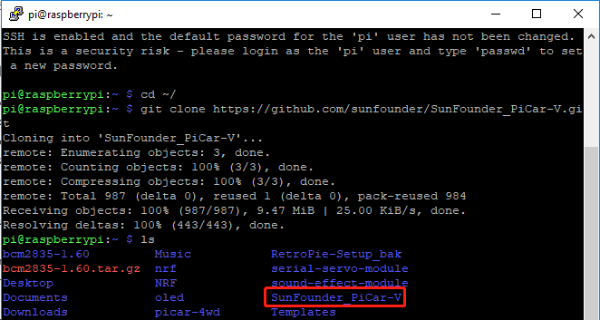
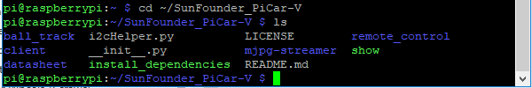

Servo Configuration
===================

And since the servos used in this kit are adjusted by software and
there's no such physical sticking point as other servos, here we need to
configure the servo via software. First you need to finish some software
installation before the configuration.

.. note::
    Please do not forget to put in the battery and slide the power
    switch to ON in this chapter.

Get Source Code
---------------

You can find the source code in our Github repositories. Download the
source code by *git clone*:

.. raw:: html

    <run></run>

.. code-block:: 

    cd ~/
    git clone https://github.com/sunfounder/SunFounder_PiCar-V -b V3.0

.. note::
    Please pay attention to your typing – if you get the prompt of
    entering your user name and password, you may have typed wrong. If
    unluckily you did so, press Ctrl + C to exit and try again.

Check by the **ls** command, then you can see the code directory
*SunFounder_PiCar-V*:

Go to the Code Directory
------------------------

.. raw:: html

    <run></run>

.. code-block:: 

    cd ~/SunFounder_PiCar-V

Enter the code directory and you can see the installation script:

Install the Environment via the Script
--------------------------------------

You can get all the required software and configuration done with the
install_dependencies script. If you want to do step by step instead,
please follow the instructions in the **Appendix 1: Function of the
Server Installation Scripts.**

.. raw:: html

    <run></run>

.. code-block:: 

    sudo ./install_dependencies

.. note::
   1. The installation script will install the required components and
      configure for the running environment. Make sure your Raspberry is
      connected to the Internet during the installation, or it would fail.

   2. The Raspberry Pi will prompt you to reboot after the installation.
      You're recommended to type in **yes** to reboot.

Configure the Servo to 90 degrees
---------------------------------

After reboot, run the picar tool:

.. raw:: html

    <run></run>

.. code-block:: 

    cd ~/SunFounder_PiCar-V
    picar servo-install

.. note::
    If the \"OSError: [Errno 121] Remote I/O error\" error message appears,
    open raspi-config:

.. raw:: html

    <run></run>

.. code-block:: 

    sudo raspi-config

Then choose **3 Interfacing Options** → **P5 I2C** → **<YES>** →\ **OK**
to enable I2C service. You can use the up, down, left, and right keys on
the keyboard to select, and then press Enter to confirm.

After the code is running, insert the rocker arm into the servo. You
will see the rocker arm is rotate in clockwise and counterclockwise,
then stop at a specific location. It means the servo is good. If the any
of the conditions below happened to your servo, your servo is bad:

1) Noisy, hot.

2) If unplug the servo line and rotate the rocker arm, it sounds like
   “ka” “ka” “ka” or there has no sounds of gear driving.

3) Rotate slowly but continuously.

If you find one of the conditions above, please send e-mail to
`service@sunfounder.com <mailto:support@sunfounder.com>`__ . We will
change a new one to you. If it is broken in the process of using or
assembling, you should go to the official website
`www.sunfounder.com <http://www.sunfounder.com>`__ to buy.
